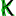

# Kelp programming language 
Kelp is a programming language. Multi-paradyme value-centric at that.

> ### bevare kelp is under heavy development. all is subject to change

# Getting started
Please refer to the [getting started](https://github.com/kelp-lang/kelp/blob/master/docs/book/getting_started.md) section of `docs/book`.

# Installing from source
> This isn't currently recommended, as kelp is highly unstable
## Requirements
- cargo
- rust stable
## Process
```bash
git clone https://github.com/kelp-lang/kelp
cd kelp

cargo build
```

# Contributing
Contributions are welcome! If you don't know what to work on, check out open issues!

---
logo by:<br>
Logo made by <a href="https://www.flaticon.com/authors/freepik" title="Freepik">Freepik</a> from <a href="https://www.flaticon.com/" title="Flaticon"> www.flaticon.com</a>
